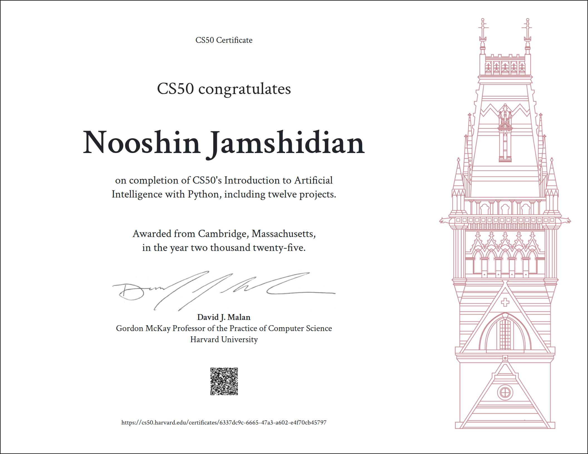

# CS50AI — Introduction to Artificial Intelligence with Python

A complete collection of my projects, problem sets, and exercises from **Harvard’s CS50: Introduction to Artificial Intelligence with Python**.  
This repository documents hands-on implementations of AI concepts — from search and logic to machine learning and reinforcement learning — all written and tested in Python.

---

## Overview

This repo contains my personal solutions and experiments for the CS50 AI curriculum.  
Each folder corresponds to a course module / week and includes:
- formal problem set solutions,
- helper scripts and notebooks (where applicable),
- short notes or README for each assignment.

All code was developed and tested in a CS50-compatible environment (CS50 IDE / Duck) and standard Python toolkits.

---

## Repository Structure

CS50AI/
├── [week0/](./week0)
├── [week1/](./week1)
├── [week2/](./week2)
├── [week3/](./week3)
├── [week4/](./week4)
├── [week5/](./week5)
├── [week6/](./week6)
└── [final_project/](./final_project)

Each directory contains the solutions for that specific week.
Additional files (like test scripts or datasets) are included where needed.

---

## Tools & Technologies
- Python 3.10+
- Jupyter Notebook & VS Code
- Libraries: numpy, pandas, scikit-learn, tensorflow, nltk
- Course platform: CS50 AI on edX

---

##  Purpose

This repository documents my journey through the CS50AI course — a foundational step toward mastering Python programming and preparing for more advanced CS and AI concepts.

---

##  License

This repository follows the CS50 Academic Honesty policy.
Code and solutions are for educational and reference purposes only.

---

## 🏅 CS50AI Certificate

